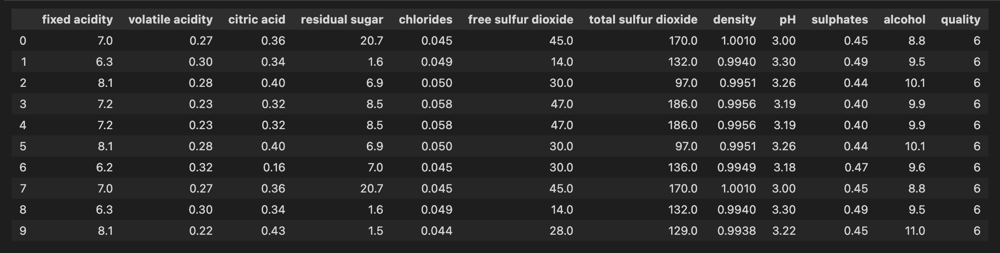
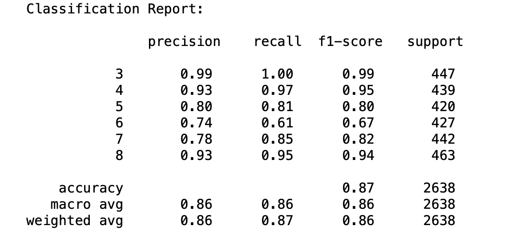
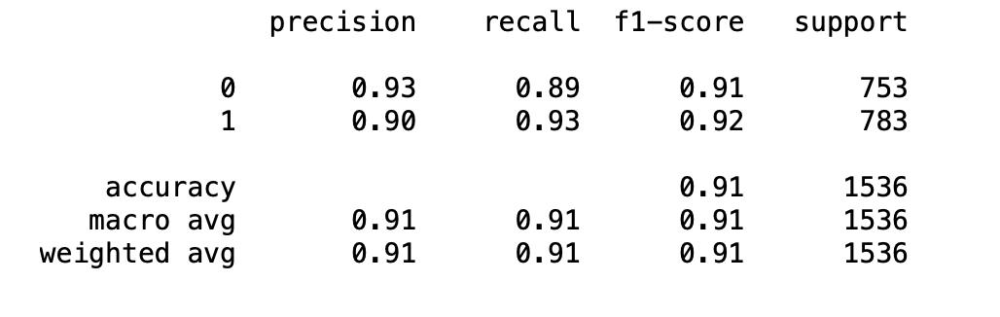
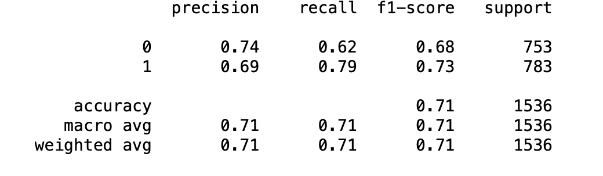

# Machine Learning final project

This is the final project in Wildau Welcome IT School

## Author

- Nosov Mykola

## Introduction

In this project I applied and compared classification models by using data “[Wine Quality Dataset](https://archive.ics.uci.edu/ml/datasets/Wine+Quality)”.



The task was to use PCA model for , but by analyzing the dataset we can see that we cannot apply PCA due to the evenly distributed data.
The solution was to convert this multiclassification problem into binary classification.
Initially, I did not use the binary system, but only removed one of the categories of wine and balanced the data to increase the percentage of accuracy

But then I defined a bottle of wine as ‘good quality' if it had a quality score of 7 or higher, and if it had a score of less than 7, it was deemed ‘bad quality’ in order to simplify the work with data and improve accuracy
I compared Random Forest Classifier with K Neighbors Classifier.

## Result
You can see results in classification score reports 
### 1. Random Forest Classifier (7 types)


### 2. Random Forest Classifier (2 types)

### 3. K Neighbors Classifier (2 types)


## TODO!

To install this project you need to enter in a terminal:

```bash
git clone https://github.com/NosovNikolay/Ml_final.git
```
**dependencies**  - make sure that you installed all of the necessary libraries:
 
```bash
pip install -r req.txt
```

